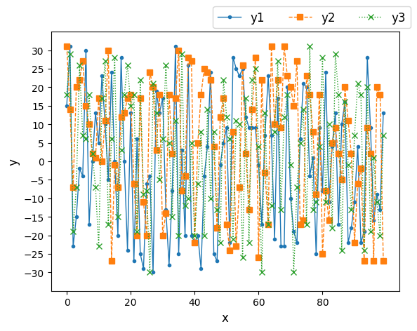

# Python
In this repository, basic python code will be committed.

## Graph Drawing
### Line Graph  
  
#### To Do  
1. Call Graph.Plot()
```
from Utils import Graph
Graph.Plot(
    [x-axis1, x-axis2, ...],
    [y-axis1, y-axis2, ...],
    [legend1, legend2, ...],
    '<option> x-axis label',
    '<option> y-axis label',
    '<option> Tag Name of "Setting.ini"',
    '<option> Output file Name',
    '<option> Setting file Name'
    )
```
2. Set graph parameters by using "SettingFile/Setting.ini"
#### Example
You can see how to use in "Example/example_LineGraph.py"